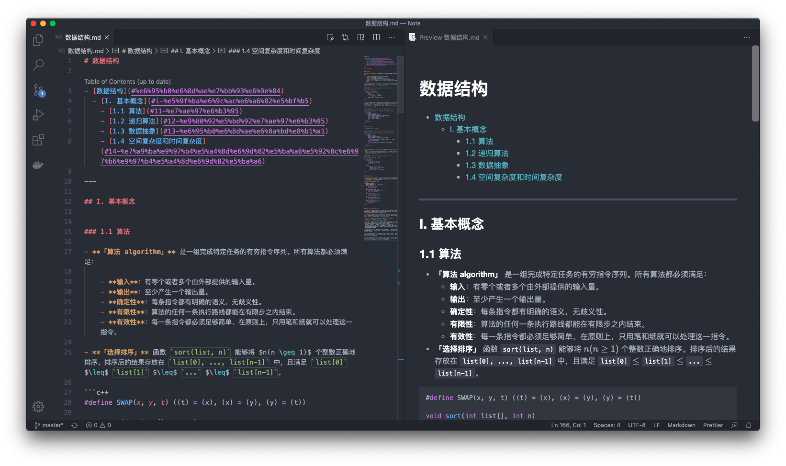

[MathJax Plugin for GitHub](https://github.com/orsharir/github-mathjaxhttps://github.com/orsharir/github-mathjax)

## Table of Content

- [数据结构](数据结构.md)
- [机器学习](机器学习.md)

## Working with VSCode.

